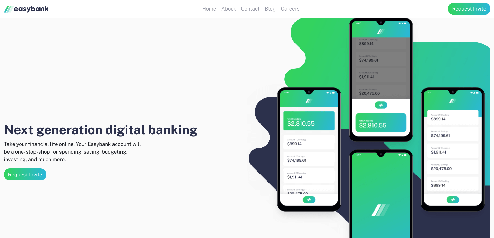
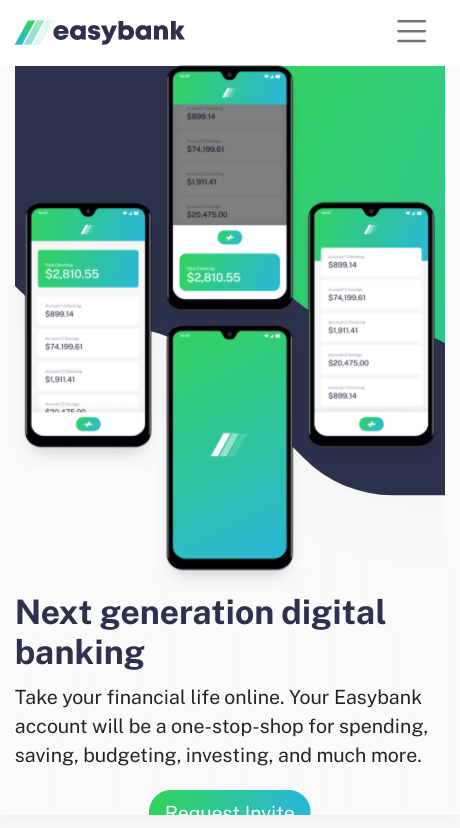
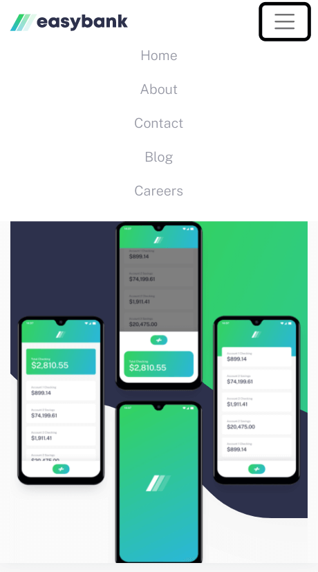

# Frontend Mentor - Easybank landing page solution

This is a solution to the [Easybank landing page challenge on Frontend Mentor](https://www.frontendmentor.io/challenges/easybank-landing-page-WaUhkoDN). Frontend Mentor challenges help you improve your coding skills by building realistic projects. 

## Table of contents

- [Overview](#overview)
  - [The challenge](#the-challenge)
  - [Screenshot](#screenshot)
  - [Links](#links)
- [My process](#my-process)
  - [Built with](#built-with)
  - [What I learned](#what-i-learned)
  - [Continued development](#continued-development)
  - [Useful resources](#useful-resources)

## Overview

### The challenge

Users should be able to:

- View the optimal layout for the site depending on their device's screen size
- See hover states for all interactive elements on the page

### Screenshot

### Links

- Live Site URL: [Github Pages](https://jdegand.github.io/easybank-landing-page/)

## My process

### Built with

- Bootstrap
- CSS custom properties
- Flexbox
- CSS Grid

### What I learned

### Continued development

- Used menu nav from bootstrap

### Useful resources

- [Bootstrap](https://getbootstrap.com/docs/5.1/getting-started/introduction/)
- [W3 Schools](https://www.w3schools.com/bootstrap/bootstrap_navbar.asp)
- [Tutorial Republic](https://www.tutorialrepublic.com/twitter-bootstrap-tutorial/bootstrap-navbar.php)
